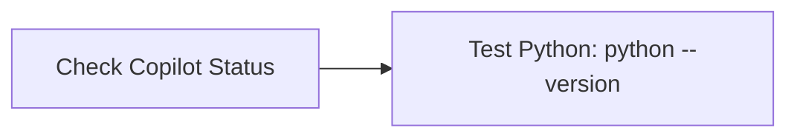
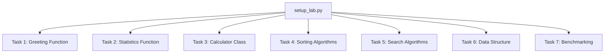

# Setup Lab

---

Welcome to the Setup Lab! This guide will help you set up your environment, understand the lab structure, and complete your tasks using GitHub Codespaces and Copilot.

---

## 🗂️ Agenda
1. [🚀 Quick Start](#1--quick-start)  
2. [🛠️ Environment Setup](#2-️-environment-setup)  
3. [📚 Lab Structure](#3--lab-structure)  
4. [💡 How to Complete the Lab](#4--how-to-complete-the-lab)  
5. [📝 Submission Checklist](#5--submission-checklist)  
6. [🔧 Troubleshooting & Help](#6--troubleshooting--help)  
7. [🤖 AI Programming Best Practices](#7--ai-programming-best-practices)  
8. [🎓 Academic Integrity](#8--academic-integrity)  

---

## 1. 🚀 Quick Start
1. **Sign up for GitHub Student Developer Pack**: Go to this website: [GitHub Student Developer Pack](https://education.github.com/pack)
3. **Open in Codespace**: Click the "Code" button and select "Create codespace on main".
4. **Wait for Setup**: Codespace will install all dependencies automatically.
5. **Start Learning**: Open the `setup_lab.py` file and begin your work.

---
## 2. 🛠️ Environment Setup

- **GitHub Copilot**: AI-powered code completion and suggestions.
- **Python**: Latest stable Python version.
- **VS Code Extensions**: Python, Copilot and more.

### Verify Your Setup

1. Ensure Copilot is active (check status bar at bottom to the right).
2. Test Python installation: `python --version`.

---
## 3. 📚 Lab Structure

- All code for this lab is in `setup_lab.py`.
- Each task is clearly marked with comments and TODOs.
- Use Copilot and VS Code to help you complete each section.

---
## 4. 💡 How to Complete the Lab

1. **Read the comments and TODOs in `setup_lab.py`.**
2. **Complete each function or class as described.**
3. **Test your code using the `if __name__ == "__main__":` block at the end of the file.**
4. **Commit your changes with clear messages.**
5. **Push your work to GitHub.**

---
## 5. 📝 Submission Checklist

- [ ] All tasks in `setup_lab.py` are completed.
- [ ] Code is tested and runs without errors.
- [ ] Clear and descriptive commit messages.
- [ ] Pushed to your GitHub repository.

---
## 6. 🔧 Troubleshooting & Help

- **Copilot not working?** Make sure you are signed in to GitHub and have access.
- **Import errors?** Run `pip install -r requirements.txt` in the terminal.
- **Kernel issues?** Restart the Jupyter kernel or codespace.
- **Extension problems?** Reload the VS Code window.

If you need help:
- Use the GitHub Issues tab for technical problems.
- Ask questions during office hours.
- Collaborate with classmates (follow academic integrity guidelines).

---
## 7. 🤖 AI Programming Best Practices

- Write clear, descriptive comments.
- Use meaningful variable and function names.
- Provide context through docstrings.
- Break complex problems into smaller parts.
- Review and test AI-generated code before committing.
- Use type hints for better AI suggestions.
- Document your decision-making process.

---
## 8. 🎓 Academic Integrity

- AI tools are learning aids, not replacements for understanding.
- Always review and understand AI-generated code.
- Follow your institution's academic integrity policies.
- Give appropriate attribution when required.

---

**Happy Coding with AI! 🤖✨**
